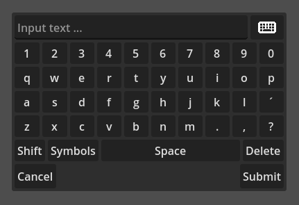
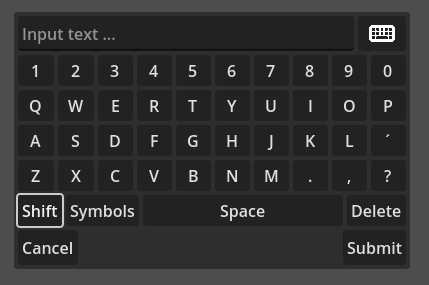
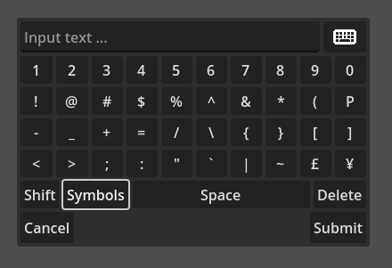

# Greenpixels OnScreen Keyboard for Godot

## Overview
`Greenpixels-OnScreen-Keyboard` is a Godot `@tool` plugin for an on-screen keyboard designed to be **controller- and touch-accessible**. It provides a virtual keyboard UI for touchscreen or gamepad input.

## Features
- QWERTY layout
- Emits signals for text changes, cancel and submit actions.
- Works with controllers and touchscreens
- Keyboard can be hidden

## Usage

> 🛈 This repository can be added as a Git submodule

When adding this plugin to your project, an "OnScreenKeyboard"-Node-Type will be added to your project.
Add that node wherever you need controller-accessible text-input.

## API
- **Signals**: 
  - `on_text_changed(text : String)`
  - `on_cancel_pressed()`
  - `on_submit_pressed(text: String)`
- **Inspector Toggles**:
  - `show_keyboard` : `bool`
  - `show_submit_button` : `bool`
  - `show_cancel_button` : `bool`

## Credits:
Keyboard Icon - by https://fontawesome.com/